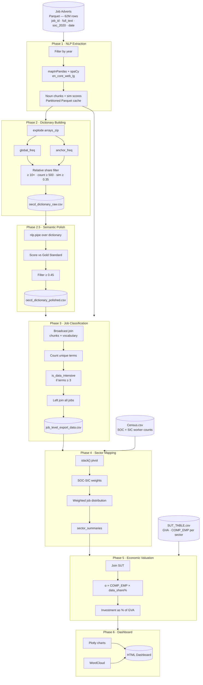

# OECD Pipeline — Technical Documentation

---

## 1. Purpose and research context

This pipeline supports macroeconomic research into the scale and economic value of data-related work across the UK economy. It operationalises a methodology aligned with the OECD framework for measuring investment in data assets, treating the wages paid to data-intensive workers as a form of capital investment — analogous to how R&D expenditure is treated in national accounts.

The core question it answers: **how much of UK GDP can be attributed to investment in data skills, and how is that investment distributed across industry sectors over time?**

---

## 2. System architecture



---

## 3. Inputs

### 3.1 Job adverts — Parquet

**Source:** Burning Glass Technologies / Lightcast online job advert data for the UK.

**Schema:**

| Column | Type | Description |
|---|---|---|
| `job_id` | String | Unique identifier per advert |
| `full_text` | String | Raw job description text |
| `soc_2020` | String | UK SOC 2020 occupation code + label (e.g. `"2433 - Data analysts"`) |
| `date` | Date | Date the advert was posted |

**Scale:** ~62 million rows, stored as Snappy-compressed Parquet.

### 3.2 Census.csv

ONS Census data cross-tabulating the number of workers in each SOC occupation against each SIC industry. Used in Phase 4 to derive the probability that a worker in a given occupation is employed in a given sector.

**Format:** Wide table — rows are SOC descriptions, columns are SIC ranges (e.g. `01-03`, `10-33`), values are worker counts.

### 3.3 SUT_TABLE.csv

UK Supply and Use Table from the ONS. Provides, per SIC sector and year:
- `GVA_basic_prices` — Gross Value Added (total economic output of the sector), in £millions
- `COMP_EMP` — Compensation of employees (total wages and salaries), in £millions

---

## 4. Phase-by-phase design

### Phase 0 — Pre-flight cleanup

Clears the Spark memory cache and deletes stale CSV files from previous runs. This prevents "ghost" data from prior configurations contaminating a new run. Controlled by the `USE_EXISTING_*` flags in `config.py`.

---

### Phase 1 — NLP Extraction

**What it does:** Reads each year of job adverts and extracts noun chunks from every `full_text` field using spaCy. For each chunk, it computes cosine similarity to the word `"data"` using pre-trained word vectors (`en_core_web_lg`).

**Why noun chunks and not individual words?**
Single words like "sql" or "python" are ambiguous — they may refer to the programming language or an entirely different context. Noun chunks (`"sql server"`, `"relational database management"`) carry semantic context that reduces false positives.

**The `mapInPandas` bridge:**
Spark distributes rows across executors, but spaCy is a single-machine library. `mapInPandas` sends batches of rows to each executor as Pandas DataFrames, runs the spaCy pipeline locally on each batch, and returns results back to Spark. The spaCy model is loaded once per executor (not per row) for efficiency.

**Cleaning rules applied to each chunk:**
- Lowercase
- Strip all non-alphabetic characters (punctuation, digits)
- Collapse whitespace
- Discard chunks shorter than 1 word or longer than 4 words
- Discard chunks with no word vector (out-of-vocabulary)

**Output format:**
One row per job, with noun chunks and their similarity scores stored as arrays (`ArrayType`). Partitioned by `doc_month` so downstream reads can filter by time period without scanning the full dataset.

**Caching strategy:**
Output is written to Parquet and checked at the start of each year's run. If the output already exists and `FORCE_RECOMPUTE_NLP = False`, Phase 1 is skipped for that year. This allows the pipeline to be interrupted and resumed without re-running the expensive NLP step.

---

### Phase 2 — Dictionary Building

**What it does:** Computes a relative frequency ratio for every noun chunk — how much more often does it appear in target occupations compared to the wider economy? Terms that are significantly over-represented in the target occupations form the domain vocabulary.

**The relative share formula:**

```
share_economy = count_distinct_jobs_containing_term / total_jobs_in_economy

share_anchor  = count_distinct_jobs_containing_term_in_anchor_SOCs / total_anchor_jobs

relative_share = share_anchor / share_economy
```

A `relative_share` of 10 means a term is ten times more concentrated in the target occupations than across the economy as a whole. This is the primary filter.

**Why `countDistinct(doc_JobID)` rather than raw term counts?**
A single job posting may repeat a term many times. Counting distinct jobs measures prevalence — how many employers require this skill — which is more meaningful for labour market analysis than counting raw mentions.

**The triple filter applied:**
1. `relative_share >= REL_SHARE_THRESHOLD` (default 10.0) — statistical concentration
2. `global_count >= 500` — minimum absolute prevalence (avoids rare terms inflating the share)
3. `avg_sim >= SIM_GROUNDING` (default 0.35) — minimum semantic connection to the concept of "data"

---

### Phase 2.5 — Semantic Polish

**Why this step exists:**
The relative share filter in Phase 2 is purely statistical. A term like `"spreadsheet skills"` might legitimately appear 15× more often in data analyst job ads than the economy average — but it is not a data engineering or database skill. Without a second filter, the dictionary would include semantically adjacent terms that inflate the data-intensity counts.

**How it works:**
Each surviving term is scored against the `GOLD_STANDARD` list — a small set of core, undeniable domain concepts chosen by the researcher. The score is the maximum cosine similarity between the term and any gold standard word. Only terms above the threshold (`0.45`) survive.

**Why run on the driver, not Spark?**
After Phase 2 filtering the dictionary is small (hundreds to a few thousand terms). The overhead of distributing this across Spark executors would exceed the processing time. Running `nlp.pipe()` on the driver with `batch_size=2000` is faster and simpler.

**Changing domains:**
To run the pipeline for a different domain (e.g. cyber security instead of database administration), change `SOC_GROUPS`, `ALL_ANCHOR_SOCS`, and `GOLD_STANDARD` in `config.py`. No code changes are required in `main.py`.

---

### Phase 3 — Job Classification

**What it does:** Joins every job's noun chunks against the polished vocabulary. Each job is scored by how many distinct vocabulary terms it contains. If that count meets or exceeds `DATA_THRESHOLD` (default 3), the job is classified as data-intensive.

**Why `DATA_THRESHOLD = 3`?**
A single matching term (e.g. `"data"`) could appear in almost any professional job and provides no signal. Requiring three distinct vocabulary-matching terms raises the bar to jobs that have genuine data skill requirements embedded in the description.

**Broadcast join:**
The vocabulary is small (hundreds of terms). Broadcasting it to every Spark executor avoids a shuffle of the full 62M-row job dataset, which would be the most expensive operation in the pipeline.

**The left join with all jobs:**
After classifying jobs that matched vocabulary terms, the result is left-joined back against the full universe of jobs. This ensures jobs with zero vocabulary matches appear in the output with `is_data_intensive = 0`. Without this step, those jobs would be silently dropped, making the denominator of the `total_data_share` calculation wrong and inflating the percentage.

**Two classification flags:**
- `is_anchor` — the job's SOC code is in `ALL_ANCHOR_SOCS` AND the job is data-intensive (strict, occupation-gated)
- `any_data_intensive` — the job is data-intensive regardless of SOC code (broad, skill-based)

The dashboard reports on `any_data_intensive` by default, since this captures data skill requirements that appear in occupations outside the anchor list.

---

### Phase 4 — Sector Mapping (SOC → SIC)

**The problem:**
Phase 3 produces data-intensity metrics at the SOC occupation level. Macroeconomic reporting is done at the SIC industry sector level. A data analyst (SOC 2433) works in many different sectors — some in finance, some in healthcare, some in information technology. The mapping must distribute the occupation's jobs proportionally across sectors.

**The Census weight matrix:**
The ONS Census cross-tabulates employment by occupation and industry. For each SOC code, the pipeline computes what fraction of workers in that occupation are employed in each SIC sector:

```
w(soc, sic) = workers_in_soc_and_sic / total_workers_in_soc
```

These weights sum to 1.0 across sectors for each SOC code.

**The stack() pivot:**
The Census CSV is wide-format (one column per SIC range). Spark's `stack()` SQL function converts it to long format (one row per SOC-SIC pair) without needing a user-defined function or Pandas conversion. The expression is generated dynamically from the CSV column names, making it robust to changes in the number of SIC columns.

**SIC sector groupings used:**

| Code | Sector |
|---|---|
| A | Agriculture, Forestry and Fishing |
| B-E | Mining, Manufacturing, Utilities |
| F | Construction |
| G-I | Wholesale, Retail, Transport, Hotels, Food |
| J | Information and Communication |
| K | Financial and Insurance Activities |
| L | Real Estate Activities |
| M-N | Professional, Scientific, Technical, Administrative |
| O-Q | Public Administration, Education, Health |
| R-T | Arts, Entertainment, Recreation, Other Services |
| U | Extraterritorial Organisations |

---

### Phase 5 — Economic Valuation

**The investment formula:**

```
total_investment = alpha × COMP_EMP_sector × (data_share_sector / 100)
```

`COMP_EMP_sector` is the total wage bill for the sector from the SUT table. `data_share_sector` is the percentage of jobs in the sector that are data-intensive, derived from Phase 3 and Phase 4. `alpha` is a capital intensity multiplier.

**What alpha represents:**
Wages alone understate the total investment value. Employers also spend on software licences, cloud infrastructure, training, and equipment associated with data work. The alpha multiplier captures this — it is derived from national accounts data and represents the ratio of total investment to the wage component for each sector. Sector-specific alphas reflect different capital intensities across industries (construction has high capital, business services are more labour-intensive).

**Three valuation scenarios reported:**

| Scenario | Alpha source | Interpretation |
|---|---|---|
| Raw wages | 1.0 | Wage cost only — strict lower bound |
| Conservative | 1.58 | Economy-wide minimum multiplier |
| Economy average | 3.62 | Average across all sectors |
| Sector-specific | Varies (2.07–6.64) | Calibrated per sector — upper bound |

**Investment as % of GVA:**
Dividing by the sector's GVA expresses investment on a scale comparable to standard national accounts statistics, allowing comparison with published ONS data on R&D investment, software investment, and other intangible capital measures.

---

### Phase 6 — Dashboard

**Self-contained HTML:**
The output is a single `.html` file with no external dependencies. Plotly.js is embedded inline (first chart call only — subsequent charts share the loaded library). Images (WordCloud) are embedded as base64 data URIs. The file can be opened offline in any browser and shared as a single attachment.

**Chart inventory:**

| Section | Chart type | What it shows |
|---|---|---|
| 1 | WordCloud image | Top 100 vocabulary terms by relative share |
| 2 | Multi-line (dual axis) | Absolute investment vs total GVA over time |
| 3 | Multi-line | Investment as % of GVA, all scenarios |
| 4 | Grouped bar (faceted) | GVA vs investment per sector per year |
| 5 | Line (by sector) | Investment intensity % over time by sector |
| 6 | Heatmap | Workforce data-intensity % by sector × year |
| 7 | Heatmap | Absolute data-intensive job volumes by sector × year |
| 8 | Grouped bar | Alpha scenario comparison by sector |
| 9 | Horizontal bar (per year) | Top 50 occupations by data-intensity % |
| 10 | Horizontal bar (per year) | Top 50 occupations by absolute job volume |

---

## 5. Configuration reference

### 5.1 Domain configuration

To run the pipeline for a new domain, only `config.py` needs to change — no modifications to `main.py`.

**Step 1 — Define target occupations:**
```python
SOC_GROUPS = {
    "cyber_security": ["2136", "3135"],
    "data_science": ["2433", "2425"],
}
```

**Step 2 — Copy every code to the anchor list:**
```python
ALL_ANCHOR_SOCS = ["2136", "3135", "2433", "2425"]
```
This must be a complete list. Omitting a code means terms from that occupation do not contribute to the anchor frequency, reducing their relative share and potentially excluding them from the dictionary.

**Step 3 — Define gold standard terms:**
```python
GOLD_STANDARD = [
    "cybersecurity", "threat detection", "penetration testing",
    "data science", "machine learning", "statistical modelling",
]
```
For a combined domain, include core terms from all sub-domains.

### 5.2 Toggle flags

| Flag | `False` (default) | `True` |
|---|---|---|
| `FORCE_RECOMPUTE_NLP` | Skip Phase 1 if cached output exists | Always re-run Phase 1 |
| `USE_EXISTING_DICTIONARY` | Recompute Phase 2 from noun chunks | Load `oecd_dictionary_raw.csv` directly |
| `USE_EXISTING_POLISHED_DICTIONARY` | Recompute Phase 2.5 | Load `oecd_dictionary_polished.csv` directly |

Recommended workflow for iterating on domain configuration:
1. Set both `USE_EXISTING_*` to `False` for the first run of a new domain
2. Once the polished dictionary looks correct, set `USE_EXISTING_POLISHED_DICTIONARY = True` for subsequent runs to save time

---

## 6. Dependencies

| Package | Version | Purpose |
|---|---|---|
| `pyspark` | 3.5.1 | Distributed data processing for 62M-row dataset |
| `pandas` | 2.2.2 | Driver-side data manipulation and CSV I/O |
| `spacy` | 3.7.4 | Noun chunk extraction and word vector similarity |
| `plotly` | 5.22.0 | Interactive chart generation |
| `wordcloud` | 1.9.3 | Vocabulary term visualisation |
| `tqdm` | 4.66.4 | Progress bars for Phase 2.5 dictionary scoring |
| `requests` | 2.32.2 | HTTP client (used in data collection scripts) |
| `urllib3` | 2.2.1 | SSL configuration for requests |

**spaCy model (not installed via pip):**
```bash
python -m spacy download en_core_web_lg
```
The large model is required. The small model (`en_core_web_sm`) does not include word vectors and will cause Phase 1 and Phase 2.5 to fail silently with zero similarity scores.

**Java:**
PySpark requires Java 11 or later. Install via `brew install openjdk@11` (macOS) or the equivalent for your platform.

---

## 7. Quality assurance

### 7.1 Automated tests

Run with:
```bash
pytest
```

**`tests/test_config.py`** — Config invariant checks (no Spark required):
- `ALL_ANCHOR_SOCS` is a subset of SOC codes defined in `SOC_GROUPS`
- All threshold values are positive and within valid ranges
- `ALPHA_MAP` covers all expected SIC sectors
- `SAMPLE_FRACTION` is in (0, 1]

**`tests/test_pipeline_logic.py`** — Pipeline logic tests (local Spark):
- Relative share calculation produces expected values
- Terms absent from anchor occupations get a relative share of zero
- Jobs meeting the data threshold are correctly flagged
- Jobs below the threshold are not flagged
- Left join preserves zero-match jobs in the output
- Sector weights sum to 1.0 per SOC code
- Economic valuation formula produces correct investment figures

### 7.2 Manual checks

After each run, inspect the following before accepting results:

1. **Dictionary size:** Open `oecd_dictionary_raw.csv` and check the row count. A reasonable range for a single occupation domain over multiple years is 200–2,000 terms. Substantially fewer suggests `SIM_GROUNDING` or `REL_SHARE_THRESHOLD` is too aggressive. Substantially more suggests they are too permissive.

2. **Dictionary content:** Scan the top 50 terms by `relative_share`. They should be recognisably domain-relevant. Obvious false positives (unrelated job titles, generic office terms) indicate the `GOLD_STANDARD` list needs strengthening.

3. **Polished dictionary retention rate:** Compare row counts of `oecd_dictionary_raw.csv` and `oecd_dictionary_polished.csv`. Retaining 30–70% of raw terms is typical. Near 100% retention suggests the gold standard filter is not working; near 0% suggests the gold standard terms are too narrow.

4. **Job-level export:** Open `job_level_export_data.csv`. Spot-check individual job IDs by looking them up in the raw data. Verify that the `full_text` genuinely contains data-related skill requirements.

5. **Audit log:** Review `pipeline_audit_log_FINAL.txt` for the total jobs tagged count and the sample of valuation output.

---

## 8. Known limitations

- **SUT data is not year-varying.** The `SUT_YEAR` parameter picks a single year's GVA and COMP_EMP figures, which are then applied across all years in `YEARS`. For multi-year trend analysis this understates variation caused by structural changes in sector composition.

- **Census weights are static.** The SOC-SIC weights are derived from a single Census snapshot. The occupational composition of sectors shifts over time and the weights do not capture this.

- **Job advert coverage is not uniform.** Online job adverts over-represent professional and technical occupations and under-represent manual, elementary, and care-sector roles. The data-intensity shares derived from this source are not directly comparable to household survey-based employment data.

- **The gold standard is researcher-defined.** The semantic filter in Phase 2.5 depends on the `GOLD_STANDARD` list, which reflects judgements about what constitutes the core of the target domain. Different reasonable choices of gold standard terms will produce different dictionaries and different investment estimates.
