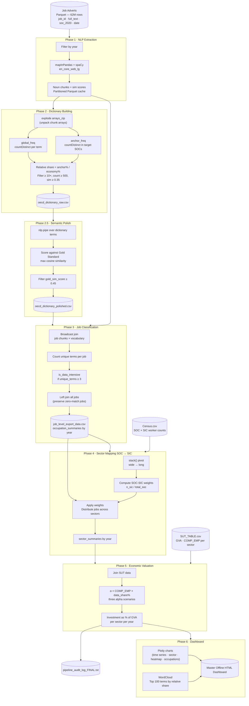

# OECD Macroeconomic Investment Pipeline

Estimates the scale of investment in data-intensive occupations across the UK economy by processing online job adverts at scale. The pipeline identifies data-related skill requirements inside job descriptions using NLP, classifies jobs accordingly, maps them to industry sectors using Census data, and computes investment figures as a share of Gross Value Added (GVA).

---

## What it produces

- A domain-specific **vocabulary** of data-related skill terms, derived statistically from 62 million job adverts
- A **job-level export** identifying which individual job adverts meet the data-intensity threshold
- An **interactive HTML dashboard** with macroeconomic investment estimates under multiple valuation scenarios, broken down by sector and occupation

---

## System architecture



---

## Setup

**Requirements:** Python 3.11, Java 11 (required by Spark)

```bash
# Install dependencies
pip install -r requirements.txt

# Download the spaCy model (required for Phases 1 and 2.5)
python -m spacy download en_core_web_lg
```

---

## Configuration

All parameters live in `config.py`. Key settings before each run:

| Parameter | Default | Description |
|---|---|---|
| `PARQUET_SOURCE` | — | Path to the job adverts Parquet file or directory |
| `CENSUS_CSV` | — | Path to Census SOC × SIC counts file |
| `SUT_CSV` | — | Path to Supply and Use Table |
| `YEARS` | `[2020–2025]` | Years to process |
| `SOC_GROUPS` | — | Target occupations, grouped by domain |
| `ALL_ANCHOR_SOCS` | — | Must contain every SOC code listed in `SOC_GROUPS` |
| `GOLD_STANDARD` | — | Core semantic anchor terms for the domain |
| `REL_SHARE_THRESHOLD` | `10.0` | Minimum relative frequency vs economy |
| `SIM_GROUNDING` | `0.35` | Minimum cosine similarity to the word "data" |
| `DATA_THRESHOLD` | `3` | Minimum unique vocabulary terms to classify a job as data-intensive |
| `SUT_YEAR` | `2023` | Year of SUT data to use for valuation |

**Toggle flags** (set `True` to skip recomputing an expensive step):

| Flag | Effect |
|---|---|
| `FORCE_RECOMPUTE_NLP` | Force Phase 1 to re-extract even if cached output exists |
| `USE_EXISTING_DICTIONARY` | Skip Phase 2, load `oecd_dictionary_raw.csv` directly |
| `USE_EXISTING_POLISHED_DICTIONARY` | Skip Phase 2.5, load `oecd_dictionary_polished.csv` directly |

---

## Running the pipeline

```bash
cd Production_ready
python main.py
```

Outputs are written to `online_job_ads/OECD/`. The HTML dashboard opens in any browser without an internet connection.

---

## Running the tests

```bash
cd Production_ready
pytest
```

Config invariant tests run without Spark. Pipeline logic tests start a local Spark session and may take 30–60 seconds on first run.

---

## Output files

| File | Description |
|---|---|
| `online_job_ads/OECD/oecd_dictionary_raw.csv` | All terms passing the statistical filter |
| `online_job_ads/OECD/oecd_dictionary_polished.csv` | Subset passing the gold standard semantic filter |
| `online_job_ads/OECD/job_level_export_data.csv` | One row per data-intensive job with year and SOC code |
| `online_job_ads/OECD/reports/Master_Offline_Dashboard_*.html` | Interactive dashboard |
| `online_job_ads/OECD/pipeline_audit_log_FINAL.txt` | Run timestamp and valuation output sample |

---

## Code quality

This project uses [Ruff](https://docs.astral.sh/ruff/) for linting and formatting, configured in `pyproject.toml`.

```bash
# Check for issues
ruff check .

# Auto-fix and format
ruff format .
```

To enforce this automatically on every commit, add a pre-commit hook:

```bash
pip install pre-commit
pre-commit install
```

And add `.pre-commit-config.yaml` at the project root pointing to the ruff hook.
