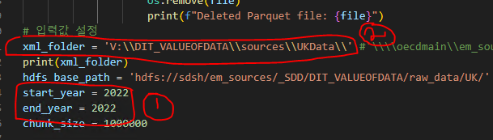
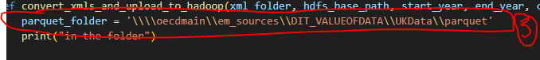
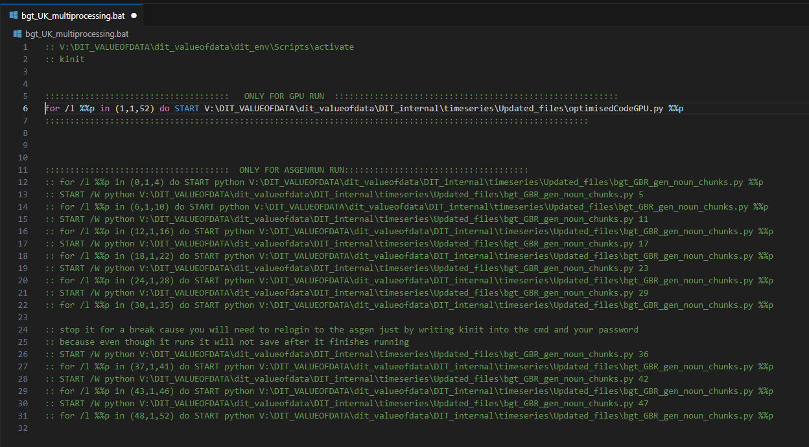
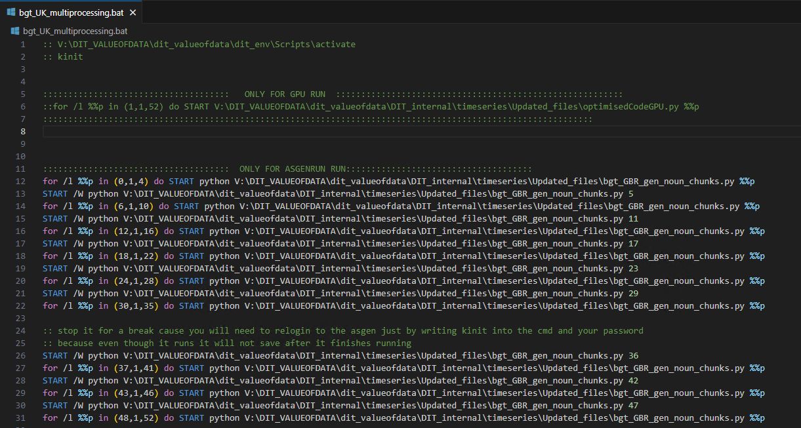

# TIMESERIES OF DATA JOBS IN THE UK
## 1. Project overview
This project is about identifying data intensive jobs on occupation and sector level in the United Kingdom. We use online job advertisements provided by Lightcast as our raw data source and we were able to get a broad range of jobs and classify which ones are data intensive and by how much. Programming language used is python. 
Here is the link to find all the project files &#8594; [Link to code](https://gitlab.algobank.oecd.org/Julia.SCHMIDT/dit_valueofdata/-/tree/main/DIT_internal/timeseries/Updated_files)

 

## 2. Sequence of the code
[A] Convert the original nova data files from xml to parquet.

[B] Apply NLP pipeline to raw job advertisement data from lightcast to generate noun chunks.

[C] Reduce the volume of noun chunks by aggregating them using data similarity criteria and job count measures.

[D] Produce data intensity scores at occupation, sector and economy level.

 

## 3. File and folder structure

The **location of the virtual environment**: V:\DIT_VALUEOFDATA\dit_valueofdata\dit_env  

**Programme codes**

Programme code for **A**: [Parquet Conversion code](https://gitlab.algobank.oecd.org/Julia.SCHMIDT/dit_valueofdata/-/blob/main/DIT_internal/production_ai/AI/conversion.py)

This code is not dependent on any other files.

 

Programme code for **B**: [Noun chunk generation code](https://gitlab.algobank.oecd.org/Julia.SCHMIDT/dit_valueofdata/-/blob/main/DIT_internal/timeseries/Updated_files/bgt_GBR_gen_noun_chunks.py?ref_type=heads)

We use multiprocessing to run the 52 files in parallel on gpu/ run the file in smaller batches on AS-GEN-SDD, so the code that you would have to run for this part is the multiprocessing code, which can be found here:  [Multiprocessing](https://gitlab.algobank.oecd.org/Julia.SCHMIDT/dit_valueofdata/-/blob/main/DIT_internal/timeseries/Updated_files/bgt_UK_multiprocessing.bat?ref_type=heads)

 

Programme code for **C**: [Reduction of data volume code](https://gitlab.algobank.oecd.org/Julia.SCHMIDT/dit_valueofdata/-/blob/main/
DIT_internal/timeseries/Updated_files/sim_reduction.py?ref_type=heads)

This code is not dependent on any other files.

 

Programme code for **D**: [Data intensity scores code](https://gitlab.algobank.oecd.org/Julia.SCHMIDT/dit_valueofdata/-/blob/main/DIT_internal/timeseries/Updated_files/US_UK_CAN_jobs.py?ref_type=heads)

Data intensity scores code is dependent on the inputs.py and the key_functions.py files to run. No changes must be made to the inputs.py and the key_functions.py file.  
Their location can be found here:
- inputs.py  &#8594;  V:\DIT_VALUEOFDATA\dit_valueofdata\DIT_internal\timeseries\Updated_files\inputs.py
- key_functions.py  &#8594;  V:\DIT_VALUEOFDATA\dit_valueofdata\DIT_internal\timeseries\Updated_files\key_functions.py

 

**Data inputs and outputs**

**[A] Parquet Conversion** 
> ***ℹ️ Note**
> **You will require permission to access the original NOVA Folder**
 

- Input &#8594; \\oecdmain\em_sources\NOVA\BGT_FT\UK
- Output &#8594; https://em-tdp-master-2.main.oecd.org:9871/explorer.html#/em_sources/_SDD/DIT_VALUEOFDATA/input_data/UK

**[B] Noun chunk generation** 
- Input &#8594; https://em-tdp-master-2.main.oecd.org:9871/explorer.html#/em_sources/_SDD/DIT_VALUEOFDATA/raw_data/UK
- Output &#8594; https://em-tdp-master-2.main.oecd.org:9871/explorer.html#/em_sources/_SDD/DIT_VALUEOFDATA/input_data/UK

**[C] Reduction of data volume**
- Input &#8594; https://em-tdp-master-2.main.oecd.org:9871/explorer.html#/em_sources/_SDD/DIT_VALUEOFDATA/input_data/UK
- Output &#8594; https://em-tdp-master-2.main.oecd.org:9871/explorer.html#/em_sources/_SDD/DIT_VALUEOFDATA/reduced_data/UK 

**[D] Data intensity scores**
- Input &#8594; https://em-tdp-master-2.main.oecd.org:9871/explorer.html#/em_sources/_SDD/DIT_VALUEOFDATA/reduced_data/UK 
- Output &#8594; https://em-tdp-master-2.main.oecd.org:9871/explorer.html#/em_sources/_SDD/DIT_VALUEOFDATA/step4Files

 

> ***ℹ️ Note**
> **You should change the country eg. UK - CAN, if you want to ran the the files for Canada and depending on the year you want to run create a folder in hadoop to add the year at the end of the path structure**
 

#### Apache Hadoop
Apache Hadoop also can be shorten to just Hadoop is a open source framework which can be used to store large files. For this project, we stored most of the files needed to run all our steps in hadoop. The size of the data that can be stored on hadoop ranges from gigbabytes to peratbytes, even smaller files, but it is more beneficial for storing large files. Read and write operations can be done to store the files in hadoop.

##### The structure of the inputs read from hadoop and the outputs written to hadoop is as follows
The files for the data work running are saved in the below folders for each of the steps:

**Parquet Conversion**  
Input: \\oecdmain\em_sources\NOVA\BGT_FT\UK  
Output: https://em-tdp-master-2.main.oecd.org:9871/explorer.html#/em_sources/_SDD/DIT_VALUEOFDATA/raw_data/UK

 

**Noun chunk generation**  
Input: https://em-tdp-master-2.main.oecd.org:9871/explorer.html#/em_sources/_SDD/DIT_VALUEOFDATA/raw_data/UK   
Output: https://em-tdp-master-2.main.oecd.org:9871/explorer.html#/em_sources/_SDD/DIT_VALUEOFDATA/input_data/UK

 

**Reduction of noun chunks**  
Input: https://em-tdp-master-2.main.oecd.org:9871/explorer.html#/em_sources/_SDD/DIT_VALUEOFDATA/input_data/UK  
Output: https://em-tdp-master-2.main.oecd.org:9871/explorer.html#/em_sources/_SDD/DIT_VALUEOFDATA/reduced_data/UK 

 

**Clarifying whether the job is database, data analytics or data entry**  
Input:  https://em-tdp-master-2.main.oecd.org:9871/explorer.html#/em_sources/_SDD/DIT_VALUEOFDATA/reduced_data/UK  
Output:  https://em-tdp-master-2.main.oecd.org:9871/explorer.html#/em_sources/_SDD/DIT_VALUEOFDATA/step4Files/

 

- Source data: https://em-tdp-master-2.main.oecd.org:9871/explorer.html#/em_sources/_SDD/DIT_VALUEOFDATA/source_data/full_source_data/UK 
This is the source data used in step 4. It is the structural Lightcast dataset with all the columns as the original dataset. We uploaded it to hadoop for all the years from the v drive because of space.

- Reduced source data: https://em-tdp-master-2.main.oecd.org:9871/explorer.html#/em_sources/_SDD/DIT_VALUEOFDATA/source_data/reduced_source_data/UK 
This is the reduced version of the source data above (It is the reduced version of the structural Lightcast dataset), so it only has the columns JobID, CanonEmployer, SICSection,
BGTOcc and BGTOccName. We need it in the DATA INTENSITY SCORES AT OCCUPATION, SECTOR AND ECONOMY LEVEL step. 

 
 

## 4. Virtual Environment
Location of the virtual environment used to run the project files &#8594;v:\DIT_VALUEOFDATA\dit_valueofdata\dit_env

Location of the requirement file &#8594; V:\DIT_VALUEOFDATA\dit_valueofdata\DIT_internal\timeseries\Updated_files\requirements.txt

##### To install libraries in the virtual environment, do the following steps:
1. Go to this directory - V:\DIT_VALUEOFDATA\dit_valueofdata\dit_env\Scripts in your file explorer
2. In the file explorer, where it shows the path location of the directory above e.g.V:\DIT_VALUEOFDATA\dit_valueofdata\dit_env\Scripts
remove the path location and type cmd.(this should result in the command line prompt appearing)
3. Write activate in the command line prompt to activate the virtual environment.
4. Write the following command when the virtual environment is activated - python -m pip install NAMEOFPACKAGE

 

> ***ℹ️ Note**
> **IF THE ABOVE STEPS DO NOT WORK WHEN INSTALLING A LIBRARY FOLLOW THE BELOW STEPS**
 

1. Go to C: in File Explorer on your local computer.
2. Open a command line and write c: and cd to the location of your virtual environment.
3. If you don't have a virtual envrionment then write python -m venv test_env in the command line to create a new virtual environement in your c drive
4. Then cd to your virtual environment.**cd NameOFVirtualEnrionment/Scripts
5. Then activate your virtual environment by writing **activate** in the command line to activate your personal virtual environment 
6. pip install packageName
7. pip freeze C:/temp/requirements_dit_new.txt
8. In another command line, write V:\DIT_VALUEOFDATA\dit_valueofdata\dit_env\Scripts 
9. Then write activate
10. After write pip install -r C:/temp/requirements_dit_new.txt in the command line.
11. **only if the venv is completely dead** pip install -r C:/temp/requirements_dit_new.txt  --ignore-installed.

 
 

## 5. Sequence of running the files

### [A] Parquet Conversion
* **FILE NAME:** conversion.py
* **DESCRIPTION:** The code converts the original dataset which is in xml format to parquet and uploads it to hadoop.
* **CODE FOR PARQUET CONVERSION:** https://gitlab.algobank.oecd.org/Julia.SCHMIDT/dit_valueofdata/-/blob/main/DIT_internal/timeseries/Updated_files/conversion.py?ref_type=heads
* **NOTE FOR CONVERSION CODE:** There was the issue of problems with the space on the v drive, so you have to create a new folder anywhere that has space (for about 14,000,000,000 bytes of data) and use that path location for **for step 2 and 3 in CHANGES TO MAKE**
* **CHANGES TO MAKE:** 
1. Change to the year you want.

2. Change the path to the location you want to store the files.  

3. Change path location to where you want to store the temporary parquet files. 

### [B] Creating noun chunks and getting the similarity of the noun chucks to the word data
* **FILE NAME:** bgt_GBR_gen_noun_chunks.py AND bgt_UK_multiprocessing.bat
* **DESCRIPTION:** The text in the data job advertisement are split into noun_chunks (which are the the sentences broken up into small part using things like the noun form, verb form etc) and get the similarity measure based on the word data.

* **CHANGE TO MAKE IN THE FILE FOR EACH YEAR:** Look for the variable name year and change the year based on the year you want to run. For the multiprocessing step which is in file (bgt_UK_multiprocessing.bat) depending on where you are running the file (GPU OR AS-GEN-SDD, uncommment the relevant code to run the file (either As-GEN-SDD or GPU)).

###### INSTRUCTION FOR WHICH CODE IN bgt_UK_multiprocessing.bat TO UNCOMMENT FOR GPU

 

###### INSTRUCTION FOR WHICH CODE IN bgt_UK_multiprocessing.bat TO UNCOMMENT FOR ASGEN 

#### Steps to follow for running the code for part B
1.  Go to the file bgt_GBR_gen_noun_chunks.py.
2.  Look for the variable year in the file and change the year variable to the year you are running.
3.  Go to bgt_UK_multiprocessing.bat file and uncomment the code for the place (ASGEN or GPU) you are running on.
4.  Open a cmd and type the following: 
    * V:\DIT_VALUEOFDATA\dit_valueofdata\dit_env\Scripts\activate (change the name of the virtual environment if it is different from dit_env)
    * kinit
    * V:\DIT_VALUEOFDATA\dit_valueofdata\DIT_internal\timeseries\Updated_files\bgt_UK_multiprocessing(the file location of the bat file)
    * Leave to run

 

### [C] Reducing the amount of noun chunks based on the similarity measure
* **FILE NAME:** sim_reduction.py
* **DESCRIPTION:** This reduces the size of the file and drops rows based on the number of the similarity data.
* **CHANGES TO MAKE IN THE FILE WHEN RUNNING FILES FOR DIFFERENT YEARS:** Look for the variable name year and change the year based on the year you want to run for, e.g if you want to run over the files for 2020, you will look for the variable year as shown in the image below and you change the year to 2020 (since thats the year for the files you want to run the sim_reduction.py on) 

#### Steps to follow for running the code for part C
5.  When all the files have finished running from **Creating noun chunks and getting the similarity of the noun chucks to the word data**:
    * Go to the sim_reduction.py file and look for the variable year. Change to the year needed/year you already ran in the previous step of the bgt_GBR_gen_noun_chunks.py. 

    * To run this file, write the following command in cmd:
        * V:\DIT_VALUEOFDATA\dit_valueofdata\dit_env\Scripts\activate (change the name of the virtual environment if it is different from dit_env)
        * kinit
        * python V:\DIT_VALUEOFDATA\dit_valueofdata\DIT_internal\timeseries\Updated_files\sim_reduction.py (change based on the location of your file)
        * Leave to run

 

### [D] DATA INTENSITY SCORES AT OCCUPATION, SECTOR AND ECONOMY LEVEL 
* **FILE NAME**: US_UK_CAN_jobs.py
* **DESCRIPTION:** Classifies the noun chunk into database, data analytics or data entry related activities and then aggregates it on occupation and sector level.
* **CHANGE TO MAKE IN THE FILE FOR EACH YEAR:** Look for the variable name year and change the year based on the year you want to run for, e.g if you want to run over the files for 2020, you will look for the variable year as shown in the image below and you change the year to 2020 (since thats the year for the files you want to run the rUS_UK_CAN_jobs.py on)

#### Steps to follow for running the code for part D
6.  When all the files have finished running from **Reducing the amount of noun chunks based on the similarity measure**:
    * Go to the US_UK_CAN_jobs.py file and look for the variable year. Change to the year needed/year you already ran in the previous step of the reduction step.
    * Might need to change the variable UK_alpha in inputs.py to 3.33 (upper bound) or 1.53 (lower bound) to run the both of them, then depending on which one you changed to either upper or lower bound change the varaible mode to either alpha_lower or alpha_upper.

    * To run this file, write the following command in cmd:
        * V:\DIT_VALUEOFDATA\dit_valueofdata\dit_env\Scripts\activate (change the name of the virtual environment if it is different from dit_env)
        * kinit
        * python V:\DIT_VALUEOFDATA\dit_valueofdata\DIT_internal\timeseries\Updated_files\US_UK_CAN_jobs.py (change based on the location of your file)
        * Leave to run

 
 

## 6. Important things to note
#### Hadoop
> Need to change the save outputs and read inputs of all files (bgt_GBR_gen_noun_chunks.py, sim_reduction.py and US_UK_CAN_jobs.py), so as to not overwrite previous files

> Sometimes https://em-tdp-master-2.main.oecd.org:9871/explorer.html#/em_sources/_SDD/DIT_VALUEOFDATA/ is down when you want to look at it on the browser, so change to
https://em-tdp-master-1.main.oecd.org:9871/explorer.html#/em_sources/_SDD/DIT_VALUEOFDATA/ and vice versa depending on which one is working.

> When https://em-tdp-master-2.main.oecd.org:9871/explorer.html#/em_sources/_SDD/DIT_VALUEOFDATA/ it doesn't affect your reading and writing to hadoop, just viewing it in your browser. Also, you might not be able to view the files in your browser from your house, only OECD. https://em-tdp-master-2.main.oecd.org:9871/explorer.html#/em_sources/_SDD/DIT_VALUEOFDATA/ works for viewing the files in your browser in your house but https://em-tdp-master-1.main.oecd.org:9871/explorer.html#/em_sources/_SDD/DIT_VALUEOFDATA/ doesn't.

 

#### AS-GEN-SDD
> When running on AS-GEN-SDD, when the files are running for a long time, the files will continue running but when it finishes it doesn't write to hadoop and close the prompt. In this case, login using to the command line using kinit in the ACTIVATED VIRTUAL ENVRIONMENT and continue running the files which are left (as some would have finished running already). 

 

#### GPU
> when running on the GPU and all the 52 files are running all together, it causes the GPU to lag, which means the gpu will be unusable for until the files finish running. 

 
 

## 7. Experiments To Validate Result
We had to run tests because the final output of the parquet file and the original csv was different. We conducted some experiments such as running on the orignal csv (in nova dataset) with the updated code for all the steps, dropping rows were the JOBtext was empty, removing the part that turned the noun chunks to lowercase in step 3 and also the code section that dropped the numbers found in the noun chunk (UPDATES MADE (from origianal version to current version of the code) WERE ALL IN  **Creating noun chunks and getting the similarity of the noun chucks to the word data** step [bgt_GBR_gen_noun_chunks.py]).   The output of those test ran to validate the results can be found in here &#8594; V:\DIT_VALUEOFDATA\outputs

##### The structure of the output folder is as follows
*   This folder has the result of running the original csv files in nova dataset with the update code(changes were dropping all the numbers, making the noun chunks lowercase and dropping the rows that had an empty jobtext) &#8594; V:\DIT_VALUEOFDATA\outputs\OriginalCSVTestingTake2

*   This folder has the result of just running the original csv in the nova dataset on using the reduction and step 4 to see if the problem with the final results between parquet and csv came from those 2 steps &#8594; V:\DIT_VALUEOFDATA\outputs\OriginalCSVFilesWithStep3And4Code

*   This folder contains the results of running the updated code using the raw data, that was in the format of parquet file ending on the updated code of step 3, reduction and step 4 &#8594; V:\DIT_VALUEOFDATA\outputs\TestingFinalResultWithParquetFiles

*   This folder contains the results of running the previous code of step 3 (no lowercase, no removing numbers from noun chunk) using csv  files(origianl nova dataset) &#8594;V:\DIT_VALUEOFDATA\outputs\TestingFinalResultWithCSVFiles

## 8. Visualisation
The data visualisation of the share increase lower and upper bound for the data intensity for 2012-2020 can be found here: V:\DIT_VALUEOFDATA\outputs\visualisation\Data Visualisations

## 9. Documentation
1. This file path S:\Data\_Users\Julia_S\Erife's Work\Result Differences Parquet and Original.docx is the research and results output of the comparison when using parquet and csv files to get the final results of 2020. The outputs were different because we had changed the code in step 3(noun chunk level). One of the reasons was using lowercase in step 3, so it made a huge difference in the final result.

2. This file path S:\Data\_Users\Julia_S\Erife's Work\TestRunsHadoop.docx contains the results of the testing the timing of running 53 files using yarn and local hadoop. Here we tried to reduce the time it took to run the files.

3. Has the firm matching for matching lightcast and orbis companies (using unique ID) to see how many companies match together. Then the result of matching the lightcast and the orbis was then used to match with the BGT reduction(https://em-tdp-master-2.main.oecd.org:9871/explorer.html#/em_sources/_SDD/DIT_VALUEOFDATA/firm_matching) and see how many companies still matched.